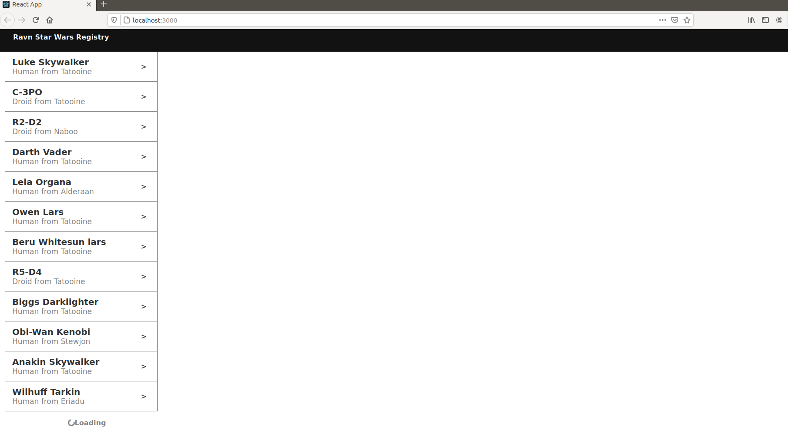
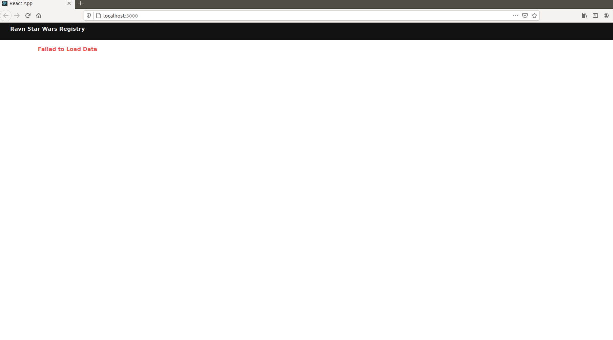
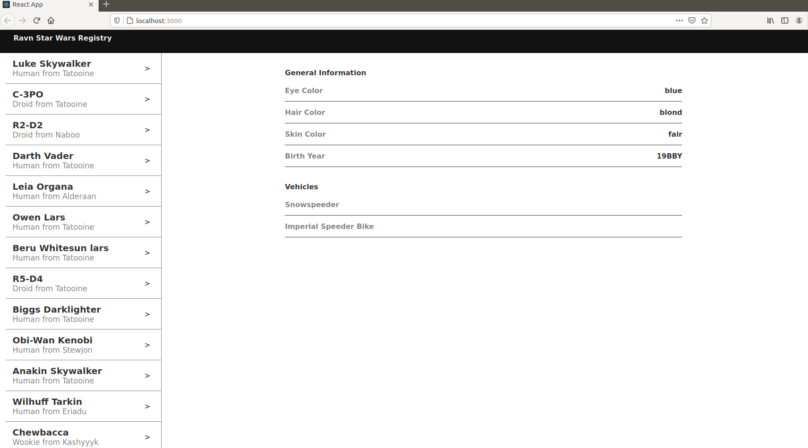

## Table of contents
* [Project Descrption](#general-info)
* [Technologies Used](#technologies)
* [Setup](#setup)
* [Screenshots](#screenshots)

## Project Description
This is a React web application that allows the user to browse the [Star Wars GraphQL API](https://swapi-graphql.netlify.app/.netlify/functions/index). The API has a fiel called **allPeople** and it is loaded by the web appication using the [Apollo](https://www.apollographql.com/) GraphQL client.

It also shows details of the characters once clicked in its cells.
	
## Technologies Used
Project is created with:
* React : 17.0
* Apollo Client: 3.3.15
* Graphql: 15.5.0
* React Bootstrap: 1.5.2
	
## Setup
To run this project, first clone this repository. 

```
$ $ git clone [URL OF THIS REPOSITORY]
```
Then, go to its root directory and run:
```
$ npm install
$ npm start
```

## Screenshots

Once the web application is running. It shows the **allPeople** field of the [Star Wars GraphQL API](https://swapi-graphql.netlify.app/.netlify/functions/index). It shows a mesagge if it is loading.



If something is wrong, it shows a notification that the query has failed.



Once any character's cell is clicked, the app loads more details about it.


When it finished loading it shows more info about the character selected. 


